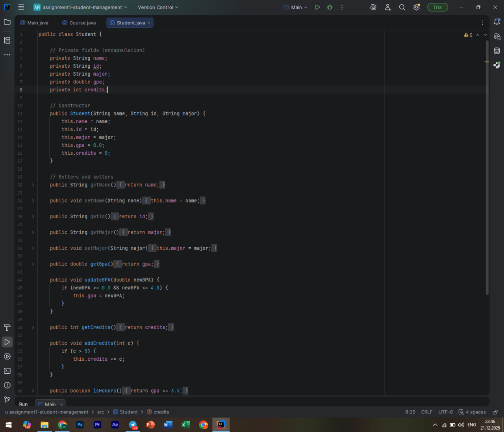
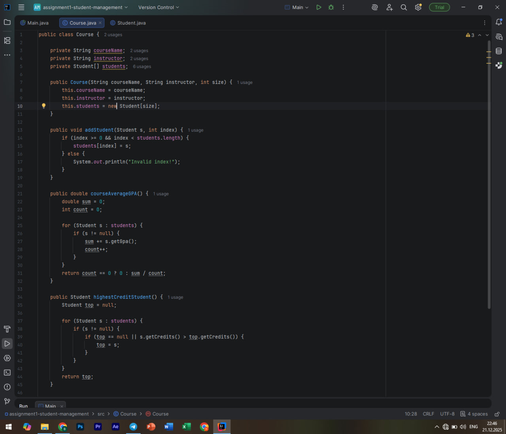
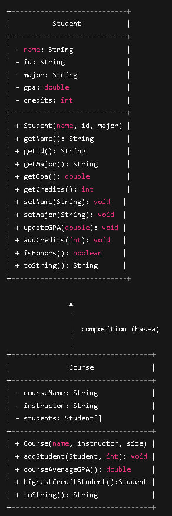
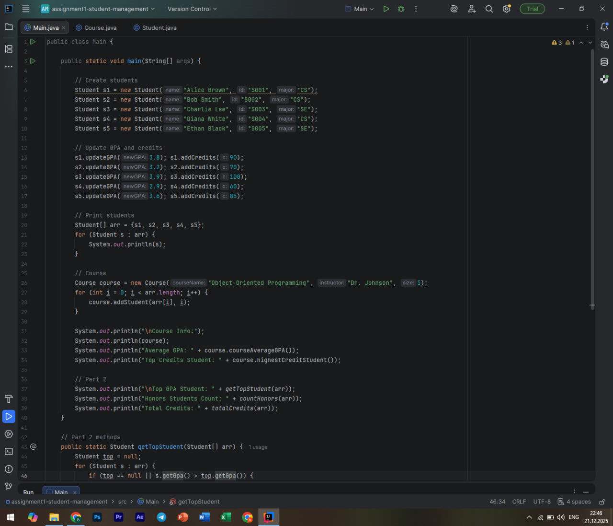
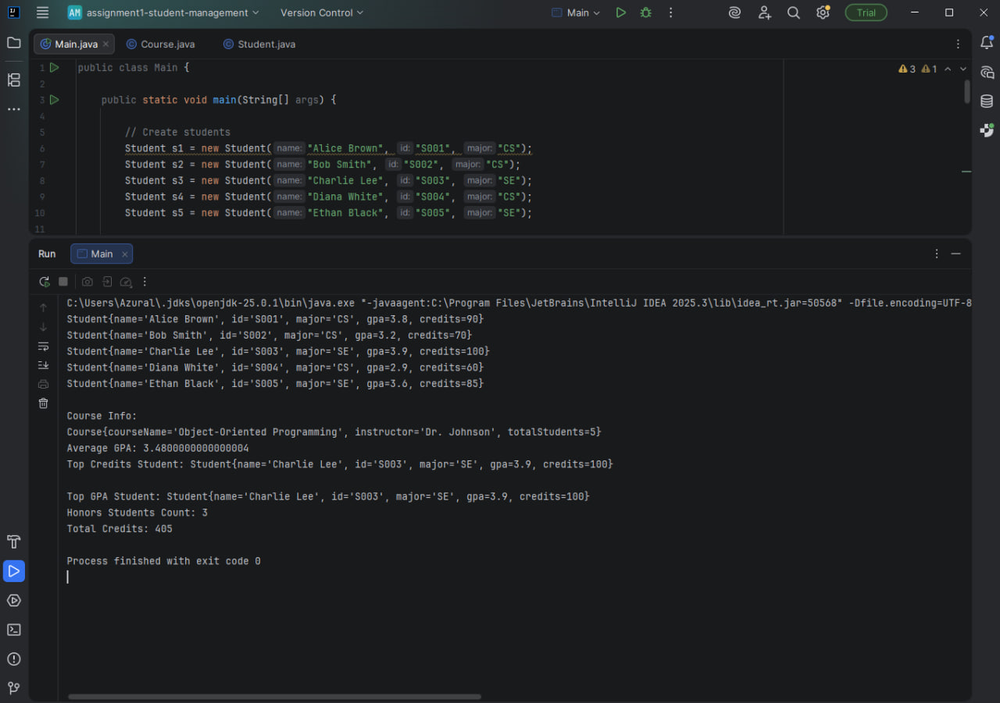

# Assignment 1: Object-Oriented Student Management System

## Project Overview
This project is a Java-based Object-Oriented Student Management System developed as part of Assignment 1.  
The goal of the project is to apply core Java fundamentals and Object-Oriented Programming (OOP) principles such as encapsulation, abstraction, and composition.

The system manages student data, calculates academic statistics, and demonstrates interaction between multiple classes using arrays of objects.

---

## Learning Objectives
- Apply Java fundamentals (data types, loops, conditions, arrays)
- Implement classes, objects, constructors, and methods
- Use encapsulation and data hiding with private fields
- Apply composition using arrays of objects
- Practice clean and maintainable Java code
- Organize a project using Git and GitHub

---

## Class Descriptions

### Student Class
The `Student` class represents a student with personal and academic information.

**Fields:**
- `name` – full name of the student  
- `id` – student ID  
- `major` – academic program  
- `gpa` – current GPA  
- `credits` – total earned credits  

**Key Methods:**
- Getters and setters for all fields  
- `addCredits(int c)` – increases student credits  
- `updateGPA(double newGPA)` – updates GPA  
- `isHonors()` – checks if GPA ≥ 3.5  
- `toString()` – returns student details  



---

### Course Class
The `Course` class represents a university course and demonstrates **composition** by storing an array of `Student` objects.

**Fields:**
- `courseName` – course title  
- `instructor` – instructor name  
- `students[]` – array of enrolled students  

**Key Methods:**
- `addStudent(Student s, int index)`  
- `courseAverageGPA()`  
- `highestCreditStudent()`  
- `toString()`  



---

## UML Class Diagram
The UML class diagram below illustrates the structure of the system and the composition relationship between the `Course` and `Student` classes.



---

## Main Program (Driver)
The `Main` class serves as the driver program and demonstrates the full functionality of the system.



---

## Program Output
The screenshot below shows the successful execution of the program.



---

## How to Compile and Run

```bash
javac *.java
java Main
